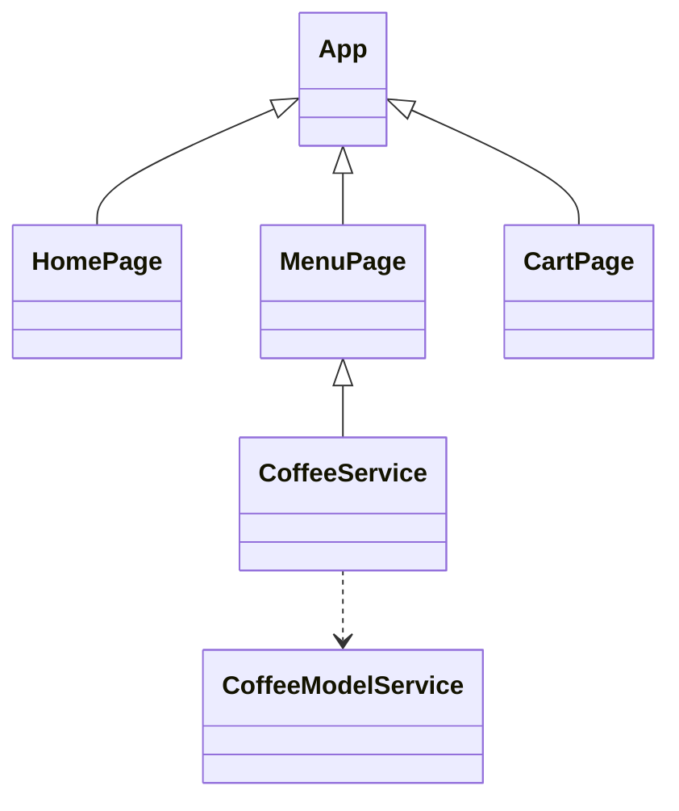

# Coffee Shop App

## UML: Component ↔ Model

```mermaid

classDiagram
    class Coffee {
        +id: string
        +name: string
        +description: string
        +price: number
        +reviews: CoffeeReview[]
    }
    class CoffeeReview {
        +id: string
        +rating: number
        +text: string
    }
    Coffee "1" o-- "*" CoffeeReview : reviews
